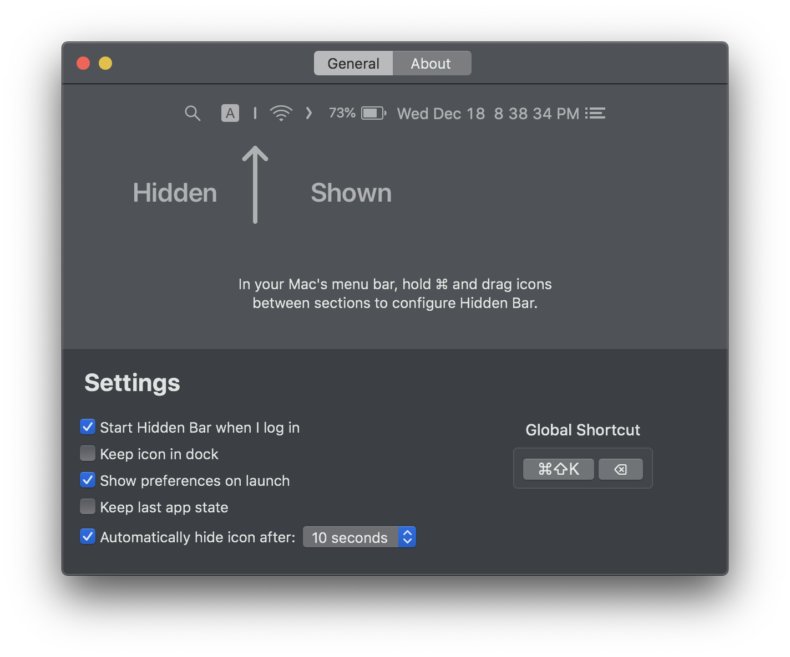
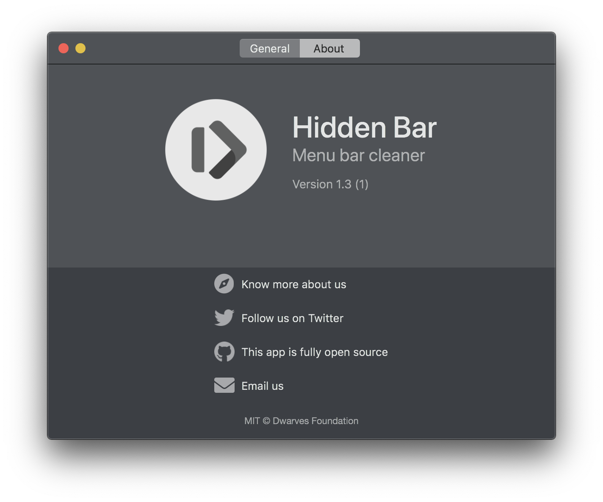

<p align="center">
	
</p>
<p align="center">
	<a href="https://github.com/sdenike/hidden/releases/latest">
 		
	</a>
	
	
</p>

# Hidden Bar Revived

**Hidden Bar Revived** is a maintained continuation of the original [Hidden Bar](https://github.com/dwarvesf/hidden) by [Dwarves Foundation](https://github.com/dwarvesf), an ultra-light macOS utility that hides menu bar items to give your Mac a cleaner look.

The upstream project has been inactive for an extended period. This fork picks up where it left off — merging the most-requested community fixes, resolving the memory leak affecting macOS Sequoia/Tahoe, and keeping the app compatible with current macOS releases.

<p align="center">
	
	
</p>

## What's new in 2.0

- Fixes the runaway memory leak that was growing to several GB on macOS Sequoia and Tahoe
- Correctly hides menu bar items on ultrawide and multi-monitor setups
- Preserves collapsed state when displays are connected or disconnected
- Additional localizations: Italian, Ukrainian, Turkish
- Minimum macOS version raised to 10.13 (High Sierra) to match current Xcode requirements

## Install

### Homebrew (once we publish the cask)
```
brew install --cask hiddenbar-revived
```

### Manual download
- [Download the latest release](https://github.com/sdenike/hidden/releases/latest)
- Drag the app to your `Applications` folder
- Launch it and drag the icon in your menu bar (hold `⌘`) to the right so it sits between some other icons

### Mac App Store
Coming soon.

## Usage

- `⌘` + drag to move the Hidden Bar icons around in the menu bar
- Click the arrow icon to hide menu bar items

<p align="center">
	
</p>

## Requirements

- macOS 10.13 High Sierra or later

## Contributing

Please read [CONTRIBUTING.md](CONTRIBUTING.md) before opening a pull request. Bug reports and focused PRs welcome — the goal of this fork is to keep Hidden Bar working, not to add major new features.

## Credits

- **Original authors:** Thanh Nguyen, Phuc Le Dien, and the [Dwarves Foundation](https://github.com/dwarvesf) team
- **Contributors:** See the full list on the [original repository](https://github.com/dwarvesf/hidden/graphs/contributors)
- **Maintainer of this fork:** [Shelby DeNike](https://github.com/sdenike)

## License

MIT — see [LICENSE](LICENSE). © 2019 Dwarves Foundation, © 2026 Shelby DeNike.
