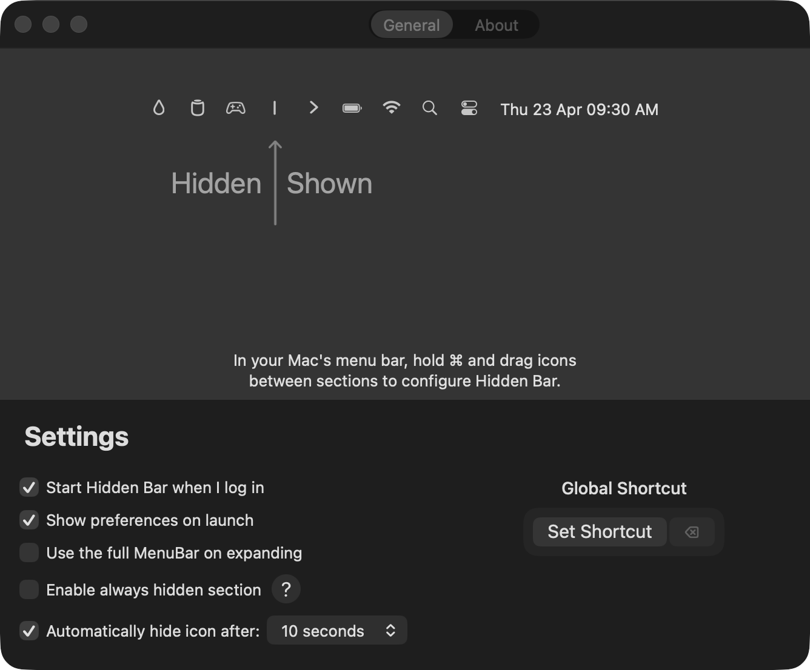
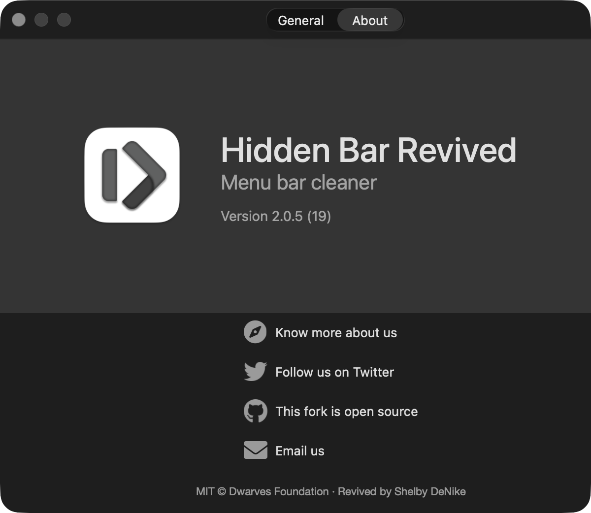
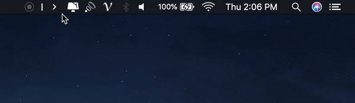

<p align="center">
	
</p>
<p align="center">
	<a href="https://github.com/sdenike/hidden-revived/releases/latest">
 		
	</a>
	
	
	<a href="LICENSE"></a>
</p>

# Hidden Bar Revived

**Hidden Bar Revived** is a maintained continuation of the original [Hidden Bar](https://github.com/dwarvesf/hidden) by [Dwarves Foundation](https://github.com/dwarvesf), an ultra-light macOS utility that hides menu bar items to give your Mac a cleaner look.

The upstream project has been inactive for an extended period. This fork picks up where it left off — merging the most-requested community fixes, resolving the memory leak affecting macOS Sequoia and Tahoe, repairing the Preferences window on modern macOS, and keeping the app compatible with current macOS releases.

<p align="center">
	
	
</p>

## What's new in 2.0

- **Memory leak fix.** Addresses the runaway leak that was growing Hidden Bar to multiple GB on macOS Sequoia and Tahoe. Adapted from community PRs #335 and #346 with additional refinements.
- **Ultrawide and multi-monitor support.** Collapse width is now computed from the widest connected display (up to macOS's 10,000 pt maximum) and collapsed state is preserved across display connect/disconnect events.
- **Preferences window rebuilt for macOS 26 Tahoe.** Compact titlebar with a centered General/About pill, no more transparent-titlebar bleed-through, no more stray "Custom View" labels.
- **Additional localizations.** Italian, Ukrainian, and Turkish added to the existing ten languages.
- **Minimum macOS raised to 13 (Ventura).** Aligns with Apple's currently-supported macOS releases as of 2026 and lets the codebase drop a stack of `#available` checks, the legacy upstream PNG icon assets, and several compatibility branches that targeted macOS 10.13 → 12. A migration to `SMAppService` for launch-at-login is planned next, which will also retire the LauncherApplication helper target.
- **Rebranded with full attribution.** App name is now "Hidden Bar Revived" and the About screen credits both Dwarves Foundation and this fork's maintainer.

See [CHANGELOG.md](CHANGELOG.md) for full release notes.

## Install

### Manual download

- [Download the latest release](https://github.com/sdenike/hidden-revived/releases/latest)
- Drag **Hidden Bar Revived.app** to your `/Applications` folder
- Launch it and drag the icon in your menu bar (hold `⌘`) to the right so it sits between some other icons

### Homebrew

Coming soon — once the first public release ships, the cask will be:
```
brew install --cask hiddenbar-revived
```

### Mac App Store

Coming soon. The fork is being prepared for Mac App Store submission under a new listing; the original upstream app currently on the Store is stale and under Dwarves Foundation's account.

## Usage

- `⌘` + drag to move icons around in the menu bar, including into and out of Hidden Bar's hidden section
- Click the arrow icon to collapse / expand the hidden section
- Optional global hotkey for toggling, configurable in Preferences → General

<p align="center">
	
</p>

## Requirements

- macOS 13 (Ventura) or later
- Apple Silicon and Intel both supported (universal binary)

## Building from source

```
git clone https://github.com/sdenike/hidden-revived.git
cd hidden-revived
./scripts/install.sh
```

`scripts/install.sh` builds the Release configuration, gracefully quits any running instance, replaces `/Applications/Hidden Bar Revived.app`, and launches the fresh build. Pass `--no-launch` to skip launching, or `--debug` to build the Debug configuration instead.

Alternatively, open `Hidden Bar.xcodeproj` in Xcode, set your Development Team under Signing & Capabilities, and run.

## Contributing

Bug reports and focused PRs are welcome. The goal of this fork is to keep Hidden Bar working — not to add major new features. Please read [CONTRIBUTING.md](CONTRIBUTING.md) before opening a PR.

## Credits

- **Original authors:** [Dwarves Foundation](https://github.com/dwarvesf) — Thanh Nguyen, Phuc Le Dien, and the wider contributor community
- **Community fixes incorporated into 2.0:** @laveez (ultrawide / multi-monitor), @huynguyenh and @rm335 (memory leaks), @gmcinalli (Italian), @voltangle (Ukrainian), @Metekilic (Turkish)
- **Upstream contributor list:** [dwarvesf/hidden/graphs/contributors](https://github.com/dwarvesf/hidden/graphs/contributors)
- **Maintainer of this fork:** [Shelby DeNike](https://github.com/sdenike)

## License

MIT — see [LICENSE](LICENSE). © 2019 Dwarves Foundation · © 2026 Shelby DeNike.
